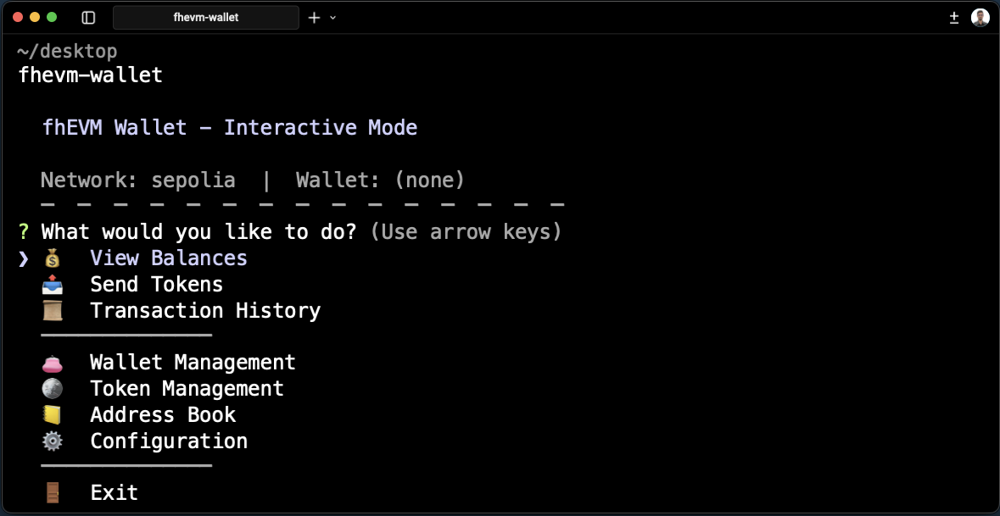

# fhEVM Wallet

A CLI wallet for managing encrypted ERC-7984 tokens using Zama's Fully Homomorphic Encryption (FHE) technology.

## Features

- **Interactive Mode** - Menu-driven terminal interface with keyboard navigation
- **Wallet Management** - Create new wallets or import existing ones via mnemonic phrase or private key
- **Confidential Token Tracking** - Add and manage ERC-7984 compliant tokens
- **Encrypted Balance Viewing** - Decrypt and view your confidential token balances
- **Confidential Transfers** - Send tokens with end-to-end encryption
- **Address Book** - Save frequently used addresses with friendly names
- **Multi-Network Support** - Works on Ethereum Sepolia testnet and Mainnet



## Installation

Requires Node.js >= 22.

```bash
# npm
npm install -g fhevm-wallet

# yarn
yarn global add fhevm-wallet

# pnpm
pnpm add -g fhevm-wallet

# bun
bun add -g fhevm-wallet
```

## Usage

Run `fhevm-wallet` or the shorter alias `fhew` to start the interactive mode:

```bash
fhew
```

### Wallet Commands

```bash
# Create a new wallet
fhew wallet create my-wallet

# Import wallet from mnemonic
fhew wallet import my-wallet --mnemonic

# Import wallet from private key
fhew wallet import my-wallet --key

# List all wallets
fhew wallet list

# Set default wallet
fhew wallet set-default my-wallet
```

### Token Commands

```bash
# Add a token to track
fhew token add 0x...

# List tracked tokens
fhew token list

# Remove a tracked token
fhew token remove 0x...
```

### Balance & Transfers

```bash
# View balances for all tracked tokens
fhew balance

# View balance on specific network
fhew balance --network mainnet

# Send tokens (interactive prompts)
fhew send

# Send tokens with arguments
fhew send 0x... 100 --token 0x...
```

### Configuration

```bash
# View current configuration
fhew config --show

# Set default network
fhew config --network sepolia

# Set RPC endpoints
fhew config --rpc-mainnet https://mainnet.infura.io/v3/YOUR_KEY
fhew config --rpc-sepolia https://sepolia.infura.io/v3/YOUR_KEY

# Set API keys
fhew config --etherscan-key YOUR_ETHERSCAN_KEY
fhew config --zama-key YOUR_ZAMA_KEY
```

### Global Flags

```bash
# Use specific network for any command
fhew balance --network mainnet
fhew send 0x... 100 -n sepolia
```

## Data Storage

All data is stored in `~/.fhevm-wallet/`:

```
~/.fhevm-wallet/
├── wallets/           # Encrypted keystore files
├── config.json        # CLI configuration
├── tokens.json        # Tracked tokens
├── addressbook.json   # Saved contacts
└── balance-cache.json # Cached balances
```

## Documentation

- [Wallet Guide](docs/wallet.md) - Detailed wallet, token, and balance documentation
- [Development](docs/development.md) - Local development setup
- [Docker](docs/docker.md) - Docker setup
- [Contributing](CONTRIBUTING.md) - Contribution guidelines

## Security

- Wallets are encrypted locally using standard Ethereum keystore format with scrypt
- Your password never leaves your machine
- **Write down your recovery phrase** - anyone with it can access your funds
- Start with testnet (Sepolia) before using mainnet

## License

MIT
