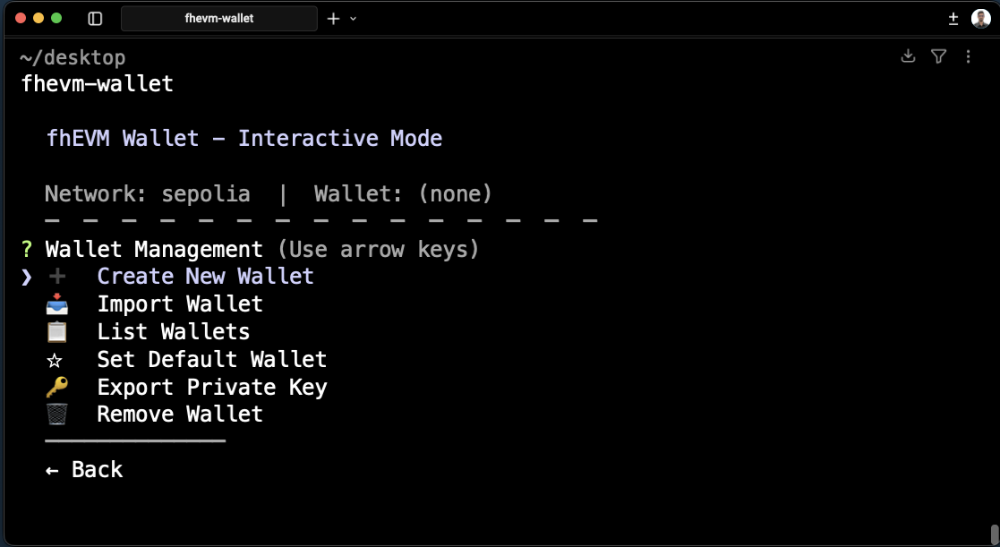
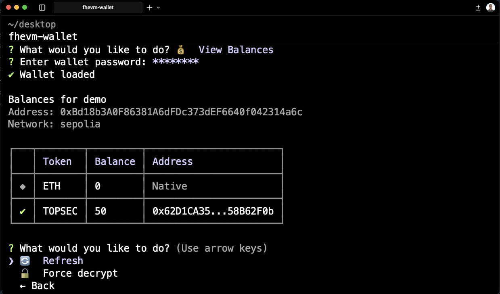
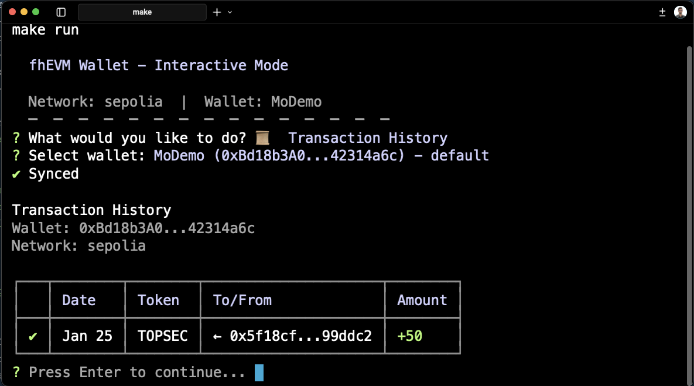

# Wallet Guide

## Wallet Management

Wallets are stored locally using the standard Ethereum keystore format with scrypt encryption.

### Storage Structure

```
~/.fhevm-wallet/wallets/
├── my-wallet.json       # Encrypted keystore
└── my-wallet.meta.json  # Metadata (name, address, creation date)
```

### Import Options

| Method                 | Use Case                                  |
| ---------------------- | ----------------------------------------- |
| **Create new**         | Generate a fresh wallet with new mnemonic |
| **Import mnemonic**    | Restore from 12-word recovery phrase      |
| **Import private key** | Import existing wallet directly           |



### Default Wallet

Set a default wallet to skip selection prompts:
- Via CLI: `fhevm-wallet wallet create my-wallet --set-default`
- Via config: `fhevm-wallet config` in interactive mode

## Token Management

Tokens are tracked per network. Adding a token fetches its metadata (name, symbol, decimals) from the blockchain.

### Storage

Tracked tokens are stored in `~/.fhevm-wallet/tokens.json`:

```json
{
  "tokens": [
    {
      "address": "0x...",
      "name": "Confidential Token",
      "symbol": "cTOK",
      "decimals": 6,
      "network": "sepolia",
      "addedAt": "2024-01-01T00:00:00.000Z"
    }
  ]
}
```

### Network-Specific

Tokens are network-bound. The same contract address on different networks is treated as separate tokens.

## Address Book

Save frequently used addresses with friendly names for quick access during transfers.

### Features

- **Deduplicated** - Cannot save the same address twice
- **Unique names** - Contact names must be unique (case-insensitive)
- **Reverse lookup** - Transaction history shows contact names when available

### Storage

Contacts are stored in `~/.fhevm-wallet/addressbook.json`:

```json
{
  "entries": [
    {
      "name": "Alice",
      "address": "0x...",
      "addedAt": "2024-01-01T00:00:00.000Z"
    }
  ]
}
```

## Configuration

Configuration is stored in `~/.fhevm-wallet/config.json`:

| Setting          | Description                       | Default   |
| ---------------- | --------------------------------- | --------- |
| `defaultNetwork` | Network to use when not specified | `sepolia` |
| `defaultWallet`  | Wallet to use when not specified  | none      |

You can also set these via environment variables in `.env`:
- `DEFAULT_NETWORK`
- `DEFAULT_WALLET`

## How Balances Work

Confidential token balances are stored encrypted on-chain. Only you can decrypt them using your private key.

### Why Balances Aren't Always Decrypted

Decryption is an **expensive operation** that requires:
1. Generating an ephemeral keypair
2. Creating an EIP-712 signature for authorization
3. Calling the FHE Gateway to decrypt

To avoid unnecessary decryption, the wallet uses **smart caching**:

| Action             | What Happens                                                            |
| ------------------ | ----------------------------------------------------------------------- |
| **Refresh**        | Checks if encrypted handle changed. If unchanged, returns cached value. |
| **Force Decrypt**  | Bypasses cache and performs full decryption.                            |
| **After Transfer** | Cache is invalidated for sender's balance.                              |

### When Decryption Happens

- When you explicitly view your balance (via `balance` command or interactive menu)
- When you select "Force decrypt" to bypass cache
- When the encrypted handle on-chain changes (indicating balance changed)

The wallet compares encrypted **handles** (cheap RPC call) rather than decrypting every time. If the handle hasn't changed, your balance hasn't changed.



### Cache Storage

Cached balances are stored in `~/.fhevm-wallet/balance-cache.json`:

```json
{
  "0xWallet:0xToken:sepolia": {
    "handle": "12345...",
    "value": "1000000000000000000"
  }
}
```

## Transaction History

### Why Some Amounts Show as "encrypted"

| Transaction Source           | Amount Display                                 |
| ---------------------------- | ---------------------------------------------- |
| **Transfers you sent**       | Shows actual amount (you provided it)          |
| **Transfers from Etherscan** | Shows "encrypted" (on-chain data is encrypted) |
| **ETH transfers**            | Shows actual amount (ETH is not encrypted)     |

When you send tokens via the CLI, the wallet records the plaintext amount locally since you know what you sent. But transfers synced from the blockchain only have encrypted data.

### Syncing History

Transaction history is synced from Etherscan API which fetches:
- `ConfidentialTransfer` events (amounts encrypted)
- ETH transfers (amounts visible)

The wallet merges local and synced transactions, preserving known amounts when available.



## Data Directory

All data is stored centrally in `~/.fhevm-wallet` in your home directory. This allows you to run the CLI from any directory while accessing the same wallets and configuration.

```
~/.fhevm-wallet/
├── wallets/              # Encrypted keystores
├── config.json           # CLI configuration
├── tokens.json           # Tracked tokens
├── addressbook.json      # Saved contacts
├── transactions.json     # Transaction history
└── balance-cache.json    # Cached decrypted balances
```

Back up `~/.fhevm-wallet/wallets/` to protect your encrypted keys.
